# Reece Doyle T3A3

# Question 1
***
	A hypothetical client has sent you an email (shown in the **Q1 Email** section), asking for you to build them a website. Write an appropriate, professional email response that shows your understanding of the client’s needs for the website, an understanding of appropriate technologies or tools needed to build the website yourself, as well as an understanding of how a team of web developers collaborates and works in the creation of a website.

```
Hello there!

My name is Alex, and I’m the director of the Super Awesome Museum (SAM). We display a variety of interesting artefacts, objects, and paraphernalia about all sorts of things from all over the world.

I’m writing to you because the SAM needs a website. The museum is new in the city, we’re fully funded and don’t sell our items but we just need to encourage people to visit the museum.

We would need a website that showcases some of our interesting exhibits and items, helps people find their way to the museum, and helps people contact the museum.

We would like to have an initial meeting with you to discuss two items:

- An explanation of the software you use in the process of creating a website.
- Understand how your team operates.

We don’t know much about this website stuff - does this sound like something that you can do? 

Looking forward to hearing from you,

Alex

Director

Super Awesome Museum

```

***
Dear Alex,

Thank you for getting in touch with us regarding the opportunity to collaborate on the Super Awesome Museum website. I can tell straight away from a quirky name like "Super Awesome Museum" that the SAM and Viking Webforge will be a tight fit! 

Along with a sense of humour, we share a passion for projects that enrich the life of the community through delivering quality educational experiences. 

Based on your initial email, I would glean that your goals are focused on creating: 

1. A visually engaging website that highlights the exhibits and events your museum has to offer.
2. An easy way for potential visitors to find and determine their best mode of transport to the SAM
3. An efficient method for potential visitors to contact your team and stay in touch about upcoming exhibits and events. 

Together, we can create an inviting and interactive online environment that will augment your artefacts, objects, and paraphernalia while also being a communication hub for you to introduce yourselves to the new neighbourhood and drive business through the doors! 

I would be more than happy to have a meeting to discuss our team, the tools we use, our design and implementation process. 

In the spirit of being educational and in the interest of maximising our time in person, I've compiled a document attached that will give you a detailed description of how Viking Webforge can work with the SAM to deliver the best website possible.

Please let me know your availability for an initial meeting where I would be happy to discuss any further questions you have. 

If you're also new to the area, I can also recommend a few good venues for such a meeting. 

Looking forward to hearing from you!

Warm Regards,

Reece Doyle
Manager
Viking Webforge
+61 412 345 678

***

#### Technologies and Software for the SAM website:

Viking Webforge is a company that specialises in Full Stack Web Development, meaning that we design both the user interface (Frontend) as well as the database, resources, and hosting (Backend) of your website.  

##### Frontend vs Backend

* Frontend: When you hear the word "website", you're more than likely thinking of what we call the frontend. This is the user interface. What people see on their screen and what they interact with, be that the layout, images, logos, buttons, forms, animations etc. This is where our artistic flair and design skills come to flourish! It's also where the SAM will be able to express it's sense of humour as a quirky and lighthearted den of high quality education!
  
* Backend: This is the boring stuff that our team oddly still finds quite enjoyable! The behind the scenes functionality that your visitors don't really need or want to see, but is essential in creating that interactive user experience we're seeking in a modern, interactive web application. It's where all the functionality for the website is handled, like the storing and retrieving of data about your exhibits, processing of contact forms, and managing bookings. 

Frontend will make sure that there is a button to click. Backend will make sure that when that button is clicked, a thing happens, and it happens quickly!

##### The MERN Stack

Our preferred Tech Stack (our "tools of the trade") is a collection of pieces of software integrated together known as the MERN stack, which will ensure your website is dynamic, responsive (works on both mobile and desktop), and scalable .  

MERN is an acronym for MongoDB, ExpressJS, React and NodeJS.

* MongoDB: is a highly scalable, non-Relational Database that will store all the information related to your exhibits. It is good for storing and retrieving very large amounts of data about just about anything. This could include but is not limited to data about your displays, past and future events, customer contact details, a booking system, educational resources and much more. The Database can grow with the SAM. 
  
* ExpressJS: This is the backend framework that will handle all of the server-side functionality. This would include the routing between the Database and the User Interface (the webpage that your visitors see). It would handle form submissions on your contact page as well. It also inserts something called middleware, which ensures your data is processed safely and securely. 
  
* React: This is the framework we use to make the most interactive and engaging user experience possible. Through the use of HTML, CSS and JavaScript in the React Framework we can create a very fast loading, modern and easy to navigate website. We could create immersive museum tours, interactive maps, carousels of photos to showcase your many artefacts, contact pages, educational resources, all right on your homepage if you wish. We can make your website responsive, meaning it adjusts to the size and orientation of the screen it is being viewed on. Your website will look and function just as well on a smart phone or tablet as it does on a desktop computer or smart board. 
  
* NodeJS: This is the server side package that allows the frontend of your website to communicate with the backend. It also allows us to use JavaScript for both frontend and backend, allowing our developers to become highly skilled with a streamlined language for all elements of our projects. Node will ensure the SAM has a fast-building website that will respond to user inputs without delays. 

##### Search Engine Optimisation

We can also integrate Search Engine Optimisation, so that your community is finding out about the museum in when they search things like "Museums near me", or when they search for particular items that you may have in your catalogue. We can optimise with meta tags, titles and descriptions. Our tech stack allows your website to load very quickly, and work on mobile devices, which are both things that search engine crawlers look for to improve your visibility in searches and improve rankings. This can be tracked by integrating Google Analytics to provide real-time data on how many people visit your webpage, how long they stay for, what pages do they look at, and what do they click on, allowing for further optimisation of your website. 


***

#### Collaboration

All projects at Viking Webforge follow a structure that can more-or-less be broken down into 7 steps:
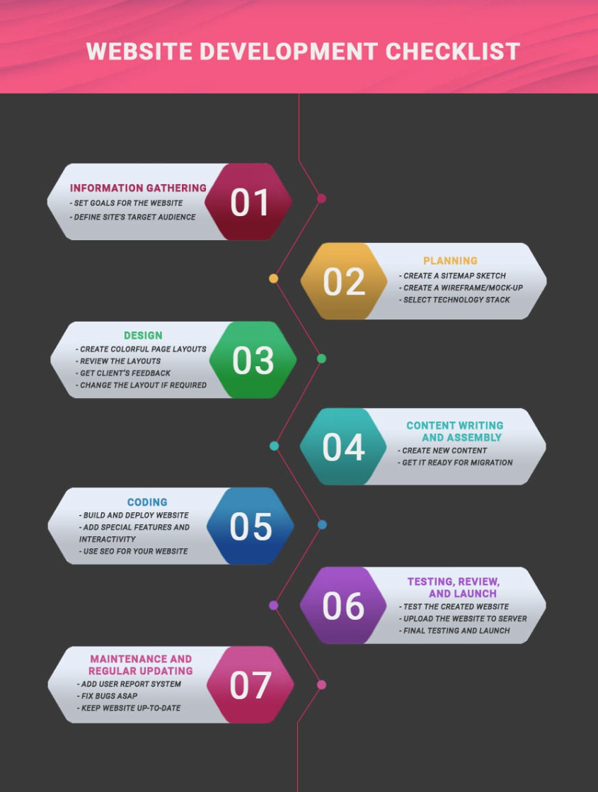
#### 1. Information Gathering (1-2 weeks)
You've already begun this step by reaching out to us! This is our first contact with a potential client where we get to know each other. We learn a bit about your museum and determine the core features you require from your website, such as galleries, events calendars, contact forms, any branding guidelines or logos you'd like to incorporate, who your target audience is as well as timeline and budget. 

#### 2. Planning (2-6 weeks)
Once we've decided to work together, this is when we have another meeting to put pen to paper and plan. We set goals and timelines with you, which some like to call the "development roadmap". This will give us the opportunity to go into greater detail for what the website will look like. We go back to our team and start breaking the project down into task. We use a Kanban board app called Trello which allows us to break each task into small steps on individual cards, delegate them to our developers, track any issues that come up, and track when each task is completed. 

At this point we like to create a very basic sitemap, which determines the structure of your website and how users will navigate between pages. This way we can determine exactly how many pages your website is going to have, and the path the user will take to navigate through them. For example, you might want every page accessible via a link form the homepage, or you might only want a smaller selection viewable. 

The final stage is that we start to create wireframes with an app called Figma. These are very simple sketches of what the layout of each page will be. Sometimes these are black and white, sometimes they have some basic colours, but they are just pictures of the pages that give you the opportunity to approve our basic ideas before we move into the design phase. 

#### 3. Design (4-12 weeks)
This is the phase where we start to design what your page will actually look like. This is when the actual logos, images, and branding guidelines are created. You make decisions on fonts, colours, button designs, size of images and everything that goes on the page. We have members of our team that specialise in UI/UX (User Interface/User Experience) who make sure that we're creating a useable website that's going to do what you want it to do and look the way it should within the capabilities of the technology. This is a process where we send designs to you, you send back feedback, and we tweak designs until you're completely satisfied. 

I imagine that you're going to want some of your items to be cataloged in your database, so this will also be when we start to design the API. An API (Application Programming Interface) is something we create for you that allows your database to talk to your user interface. This is how information will be created, read, updated or deleted in your system. This would also allow you to share information about your exhibits with other organisations in the future. 

This is one of those big, backend things that's not intended to be visually stimulating, yet still brings overwhelming satisfaction to our developers. We have some developers in our team that greatly prefer this to UI/UX, so that's what they mostly focus on.  

#### 4. Content Writing (5-15 weeks)
This is when we make sure that you've got all the content that you want to go on your website to us. This is mostly the text based content. 

Most of the information about your exhibits will end up in the database, accessed by the API that we designed in the previous step. 

For example, let's say you have a Viking's Toothbrush you might like to store information about in your database. While you see a bright and colourful page with a bright picture and a nice font, this is what your database will store:

```json
{ 
	"item_id": "001", 
	"name": "Viking's Toothbrush", 
	"category": "Historical Artefact", 
	"description": "An ancient Viking-era toothbrush, believed to have been carved from a whale bone and used with herbal pastes. Surprisingly ergonomic for its time!", 
	"origin": { 
		"region": "Scandinavia", 
		"estimated_year": 975, 
		"discovered_at": "Norwegian coast", 
		"discovered_by": "Dr. Ingrid Yngvar" 
	}, 
	"dimensions": { 
		"length_cm": 12.5, 
		"width_cm": 1.8, 
		"weight_g": 50 
		},
```

Don't worry if that looks a little daunting. We don't expect you to create that code. We'll do that. We'll guide you with the most efficient formate to send the data to us. 

#### 5. Coding! (6-15 weeks)
Once you've approved everything we've designed, sent through all your content and assets, we get to work coding! We generally start with the homepage, and then work one subsequent pages. At this point, all of the initial creative decisions have been made. We go away for a bit until we have our first version of the website ready for you to begin testing. 

During this development phase, every line of code that our developers write is tracked by a version control application called Git, and stored and shared through an online platform called GitHub. It allows every version of every page we create to be tracked, checked, tested and approved by our senior developers before it is approved to be added to the release version of your website. It's actually quite ingenious. It is extremely robust, and makes it almost impossible to lose anything! 

if we make a change that breaks something, or makes something ugly, we can simply restore from a previous commit that we know worked and was not ugly. It's extremely handy!

#### 6. Testing, Review and Launch (2-4 weeks)
This is the point where we have a working version of the website. We test for it's compatibility across multiple devices (tablets, smartphones, desktops) and browsers (Chrome, Safari, Firefox, Edge, etc.), as well as testing the accessibility of your page for people with disabilities. We test that every link, and feature works. At this point you'll also have a chance to see how the site functions and looks and let us know if there's any last minute changes. 
NB: There is almost always changes. It's okay to change your mind on things!
Once the site has been reviewed and iterated on, deploy the site for launch! 

#### 7. Maintenance and updating (ongoing)
Over time, the website will obviously need to be updated and and expanded. We continue to deliver ongoing support for any updates, security patches or new features you need to build in the future. We can also make use the data we get from Google Analytics to determine what parts of the site might need to change to better fulfil it's purpose to educate, connect, and entertain. 


***
### References

Erickson, Jeffrey, What is the MERN Stack? Guide & Examples, 2024,
https://www.oracle.com/au/database/mern-stack/#explained

Arkhipov, Artem, React SEO: how to Optimise Web Applications for Search Engines, 2024,
https://www.techmagic.co/blog/react-seo/#:~:text=Yes%2C%20tools%20like%20Next.,head%20tag%20for%20better%20SEO.

Mitsiakina, Julia, Website Development Process: Full Guide in 7 Steps, 2023,
https://xbsoftware.com/blog/website-development-process-full-guide/


***
<div style="page-break-after: always;"></div>


# Question 2
***
	Think back to a scenario or situation in your own software development projects or work. Explain how you would do things differently if you had a chance to go through that scenario again, using an appropriate reflective cycle or reflection technique.
***
My T2A2 assignment was a difficult task that I learned a lot from, and given my time again I would definitely do differently. To analyse the process, I'll use the Gibb's reflective cycle, as pictured below:
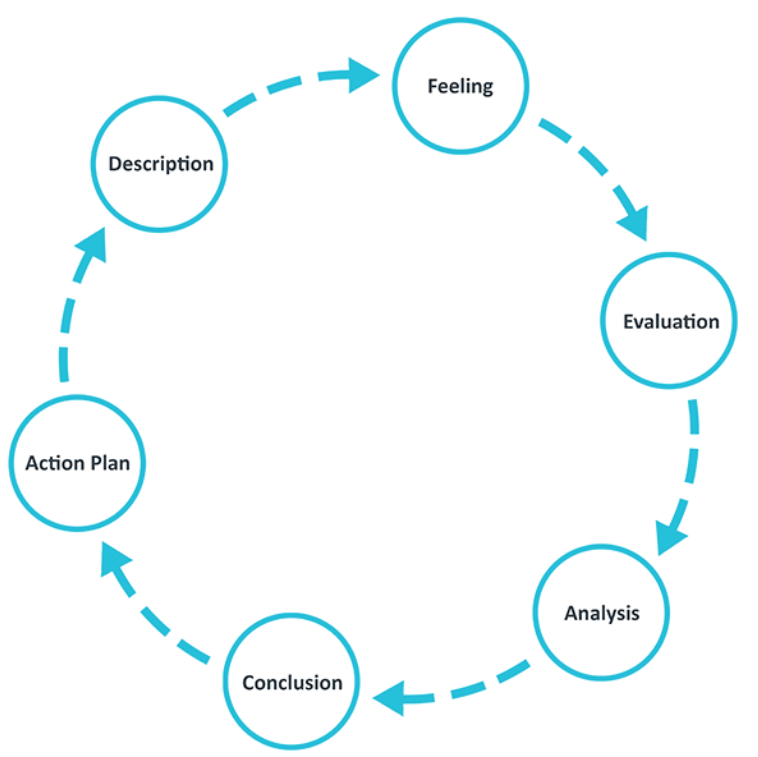


### Description

T2A2 was a Flask API assignment where I chose to make a Database to streamline the organisation of a Wedding Band. I have many years experience as a professional musician, so I felt I was well equiped to make an effective API, as it was what I knew. 

### Feeling

While I was able to complete a task within the time allotted, I felt pretty disappointed with the outcome. I had to change so much about the app that by the time it was completed it didn't have anywhere near the functionality that I had intended it to have. It was also a very frustrating process, as I was attempting to do something very complex and above my skillset. 

In retrospect, I don't feel as bad about this task now as I did then. The negative feelings about this task have taught me to be more careful to understand my limitations when coming up with ideas for apps. I've also learned about what happens when I'm under a time crunch and how to avoid the stress by spending more time planning.  

### Evaluation
##### The Good:
I did get a completed app, and I was able to communicate where I went wrong, and why it was going wrong. I learned some valuable lessons about communicating ideas more effectively in the planning phased and to ask more questions. 
##### The Bad:
It was a very stressful and frustrating experience. I was trying to do something far too difficult, and I didn't allocate my time well. 

### Analysis

My goal was to be have a Gig entry with many other tables that contributed data, such as the Musicians playing the gig, the Venue, the Booking Agent, the Setlist, and the songs for the gig. 


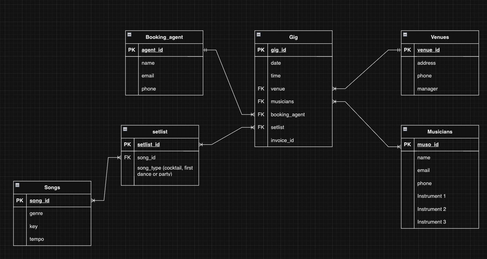

This first ERD was approved, but I would begin to notice issues with my design almost straight away. There needed to be join tables between songs and setlist tables, but also the musicians and gig table and neither are indicated.

My initial intention was to have a database of musicians that could be added to the gig table. Unfortunately I realised that I'd actually only allowed for a single field. My understanding is that this would populate with only a single musician. That wasn't going to work, as I wanted it to be able to specify which combination of musicians would be performing. It's not uncommon for musicians to either have multiple bands that they work within. Some have no band at all and just "float" between gigs. To get around this I moved to a different iteration of my ERD.

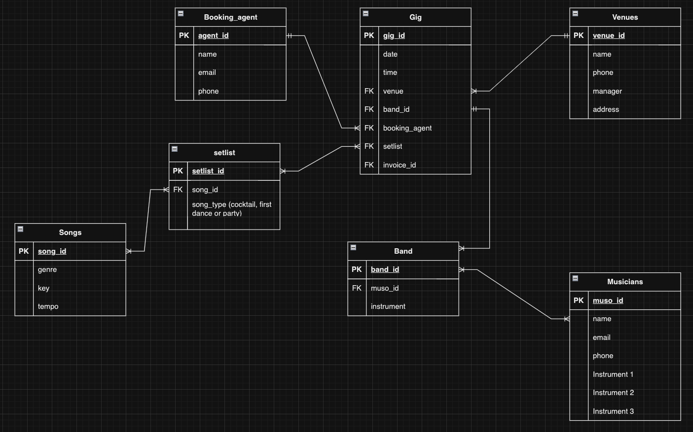
The introduction of the band table was intended to work as a place to create a band for the gig, and specify who was going to play what in the band, as many musicians are multi-instrumentalists. This was a many-to-many relationship that required a join table. I learned the hard way about why join tables are hard to use. 

I spent a lot of time trying to make this work, and I didn't ask enough questions. I was letting my pride drive me at this point, and I though I could figure it out myself with online resources when I should really have just spent more time in the design phase and started with something much smaller and built outwards.

To get around this, I attempted to have all the musicians specified in the gig table. I figured this would eliminate the need for the join table, but it caused issues with serialising multiple foreign keys. I also had the issue of being able to put multiple instances of the same musician into a single gig, which is obviously not ideal.

I then realised that I had made the same mistake with the setlist and songs list. I had originally intended to have a table for each of the functions music plays in a wedding; Cocktail Hour, First Dance and Party Hour.

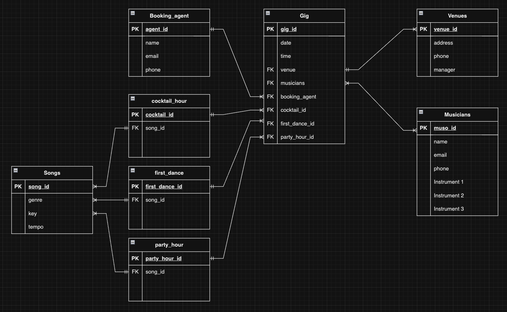

I though this problem was solved by having the function turned into an attribute on the setlist table. This also didn't work as we're still talking a many-to-many relationship requiring a join table, which I AGAIN (I guess I'm a slow learner) spent far too long trying to make work.

To design my way out of this, I boiled the songs required down to the most important songs of the evening: The First Dance, and the music played as one of the parties walks down the Aisle. Thus, I replaced the songs and setlists tables with the First Dance Song and Aisle Songs tables in the final app.

The work around that I came up with far too late was that I could've sorted the musicians into tables depending on their instruments: Drums, Guitar, Vocals, Bass, Keys, etc. This would've allowed me to have multiple musicians on the table at once. Each gig generally only has one of each instrument. To make use of the musician table that I'd already created, I had a musician in the gig table, who would function more as bandleader. At the absolute least, defining the person in charge eliminates some squabbles and delegates responsibility.

Eventually I arrived at a very different ERD from where I started.

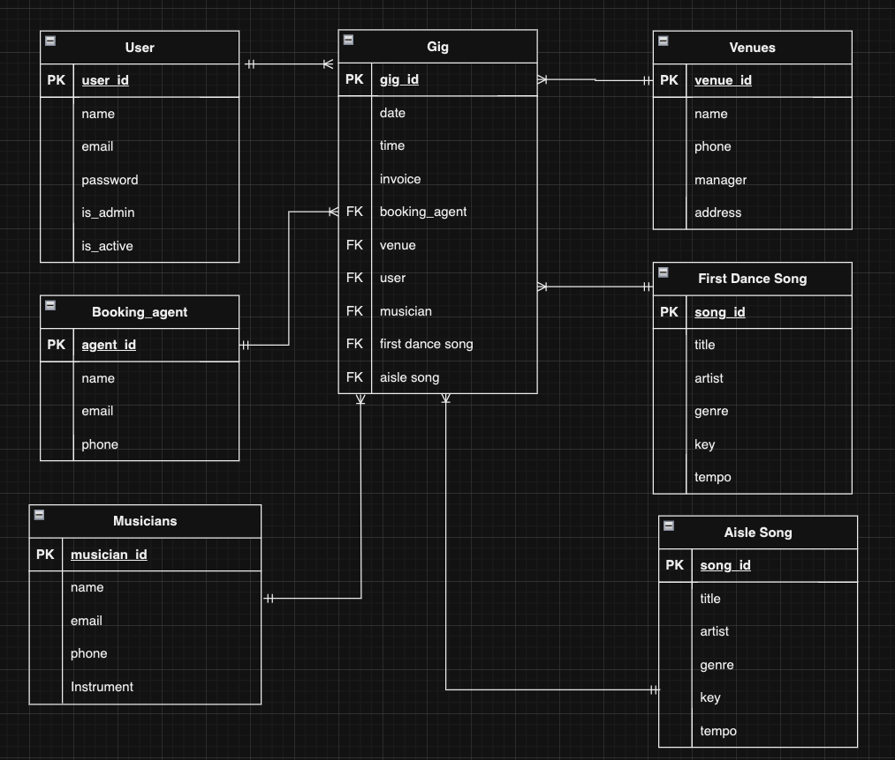

### Conclusion

I learned that I need to spend more time in the planning phase and start smaller. I also need to be able to communicate better, as I feel I must have misrepresented my idea with the initial ERD. If I'd had a better description, it would've been more likely that my very obvious design mistakes would've been picked up before it was approved. 

There is also some possibility that if I'd managed my time better I would've been able to dedicate more time to the Join Tables problem and solve it, as it is a solvable problem, albeit difficult and potentially not recommended for this particular use case. 

I could also have spent more time developing a user story for the app. How many tools does a Band Leader need for a wedding gig, and should they all be one app? If I'd spent more time thinking about the major problem they face (making sure you've got musicians who can play the gig and know all the songs), I think I would've come up with a very different app idea in the first place. 

### Action Plan

If I had to build this app again, I would start with something simple and small.  The Song list element of this app would've been more than enough to meet the criteria of the assignment and would be more inline with my skillset. I would make the app a "setlist builder" and I would incorporate the Spotify API, as all of the data that I needed was already available there. No need to double handle data. 

***
### Opportunities for Growth and Opportunities for self-improvement:

I've learned more from this assignment that has had considerable adversity than assignments that have gone more smoothly. It's offered me many opportunities for growth and self improvement:

* Spend more time in the planning phase and take the user story more seriously, as there is nothing more wasteful than doing efficiently what does not need to be done. 

* Start earlier, and plan for longer. 

* Begin with a smaller idea than I think I can manage and iterate outwards, rather than having to iterate inwards and par back ideas that haven't worked.

* Under promise and over deliver, not the reverse. 

* Avoid getting stressed by allowing myself more time, and be more patient with myself. I don't come from a technical background and this is a completely new field to me. 

* Let go of the bad idea I've had, and move onto the next good idea. 

* It's more important to have completed apps than perfect apps. Skill comes with repetition, so I need to just keep making more apps and not let emotions control my decisions. 

* Spend more time studying the things that didn't work, and better understand why they didn't work. Did I ever need to use that tool in the first place? Where would that tool actually be useful?
***

### References

Gibbs G (1988). Learning by Doing: A guide to teaching and learning methods. Further Education Unit. Oxford Polytechnic: Oxford.
https://www.ed.ac.uk/reflection/reflectors-toolkit/reflecting-on-experience/gibbs-reflective-cycle

***
<div style="page-break-after: always;"></div>


# Question 3
***
	A large part of career growth as an information technology professional happens through networking and workshops, often found at online or in-person events or workshops. 	Create an action plan that identifies several relevant networking opportunities for you to participate in or attend, and add some information about what you expect to gain or grow through each item in the action plan.
***
IDENTIFIES MULTIPLE appropriate opportunities for industry networking or professional development, and CREATES a DETAILED action plan or schedule with DETAILED information about the opportunities.

Being in based in Newcastle NSW, my network is a bit smaller than it would be if I was living in a capital city. 

The most obvious first step I took

***

### References

***
<div style="page-break-after: always;"></div>


# Question 4
***
	Explain the uses of language-learning model technologies (such as ChatGPT) on written and technical works, such as reports and software projects.
***
IDENTIFIES MULTIPLE uses of relevant modern technologies and provides a DETAILED EXPLANATION about each of the uses in the context of written AND technical works, referencing real-world data, examples or events.

AI tools like ChatGPT are here to stay, and should be embraced by the development community rather than feared. They will not replace the job of a human. They exist to augment the work that only humans can do. They can be used to carry out some of the more mundane tasks that don't necessarily require any critical thinking, thus making an already effective developer even more effective. 

There are many uses where an AI can save a considerable amount of time, freeing up developers to work more efficiently, without having to compromise on quality assurance. 

### Debugging

The most obvious way to use an AI when coding is to use it on code that is proving difficult to debug. Looking at a very large codebase that might have gotten out of hand, or fatigue can lead to simple errors. This would be scalable from very simple mistakes to large mistakes, but would be especially helpful for junior developers. 

An example might be detecting something as simple as a comparison operator error:

```python
def compare_numbers(a, b): 
	if a = b: 
		print("Both numbers are equal") 
	elif a > b: 
		print(f"{a} is greater than {b}") 
	else: 
		print(f"{b} is greater than {a}") 
# Test the function 
compare_numbers(10, 5)
```

The error in this code is that the `=` in the first `if` statement would be an assignment operator, rather than a comparison operator like it was intended. This would raise a `SyntaxError`, as you can't assign values from inside the `if` statement.

ChatGPT would be able to pick this up from context and give a corrected version. It can also give an explanation like the one above to a junior dev who isn't sure why they've gotten an error. 

The corrected code with the comparison operator would look like this:

```python
def compare_numbers(a, b): 
	if a == b: 
		print("Both numbers are equal") 
	elif a > b: 
		print(f"{a} is greater than {b}") 
	else: 
		print(f"{b} is greater than {a}") 
# Test the function 
compare_numbers(10, 5)
```
The output of this code would now be:

```python
10 is greater than 5
```


### Code Generation

Staying with junior developers, ChatGPT can generate code from simple no-code prompts.

"I need a Python function that tests if a string is a palindrome " generated this code, with a detailed explanation of how it works:

```python
def is_palindrome(s): 
	# Remove any spaces and convert to lowercase 
	cleaned_str = s.replace(" ", "").lower() 
	
	# Check if the string is equal to its reverse 
	return cleaned_str == cleaned_str[::-1] 
	
# Test the function 
print(is_palindrome("Racecar")) # Output: True 
print(is_palindrome("Hello")) # Output: False 
print(is_palindrome("A man a plan a canal Panama")) # Output: True

# How it works:

# The function removes spaces and converts the string to lowercase using `replace()` and `lower()`.
# - It then compares the cleaned string to its reverse (`cleaned_str[::-1]`).
# If the string is the same forward and backward, the function returns `True` (meaning it's a palindrome); otherwise, it returns `False`.
```

It can then translate code.

"Can you please convert that code to javascript" generated this code:

```javascript
function isPalindrome(s) {
    // Remove any spaces and convert to lowercase
    const cleanedStr = s.replace(/\s+/g, '').toLowerCase();
    
    // Check if the string is equal to its reverse
    return cleanedStr === cleanedStr.split('').reverse().join('');
}

// Test the function
console.log(isPalindrome("Racecar"));  // Output: true
console.log(isPalindrome("Hello"));    // Output: false
console.log(isPalindrome("A man a plan a canal Panama"));  // Output: true

/* 
How it works:

- The function uses a regular expression `/\s+/g` to remove all spaces from the string and converts it to lowercase with `toLowerCase()`.
- It then splits the cleaned string into an array of characters using `split('')`, reverses the array with `reverse()`, and joins it back into a string with `join('')`.
- Finally, it checks if the cleaned string is equal to its reversed version, returning `true` for a palindrome and `false` otherwise.
*/
```

### Instructions

ChatGPT can also give quite detailed instructions if you're learning something new. 
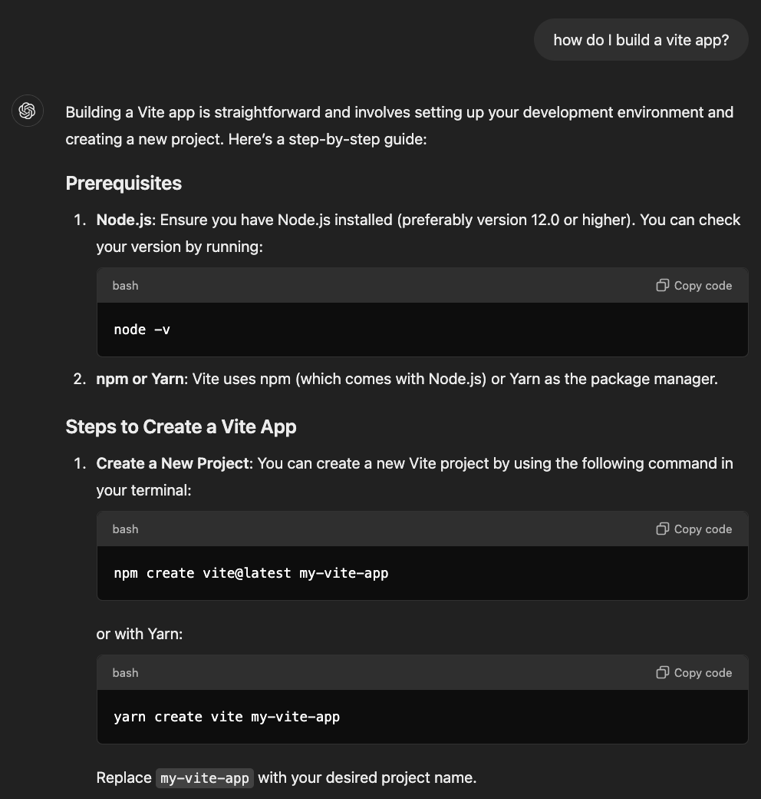

Considering that it is able to generate code, fix copy and paste code that is incorrect, translate code, and even instruct a user on how to create apps, the possibilities are extremely wide reaching and deep, and seem limited only by the developers imagination. I was even able to get it to create a very basic setup for a react app that I could download and open in VS code:
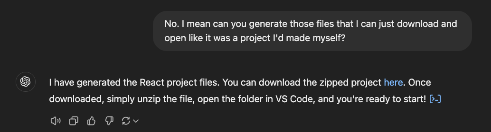
Granted, it took a few attempts to get the prompt right, but here is the app it generated, open in VS Code:

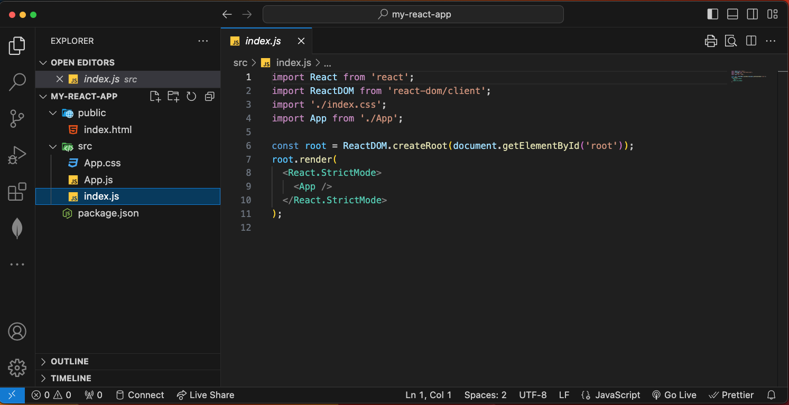

There are many more examples that I could go through, but they're all going to be essentially some expansion on generating, translating, or checking code. 

The same points very much apply to written work as well. 

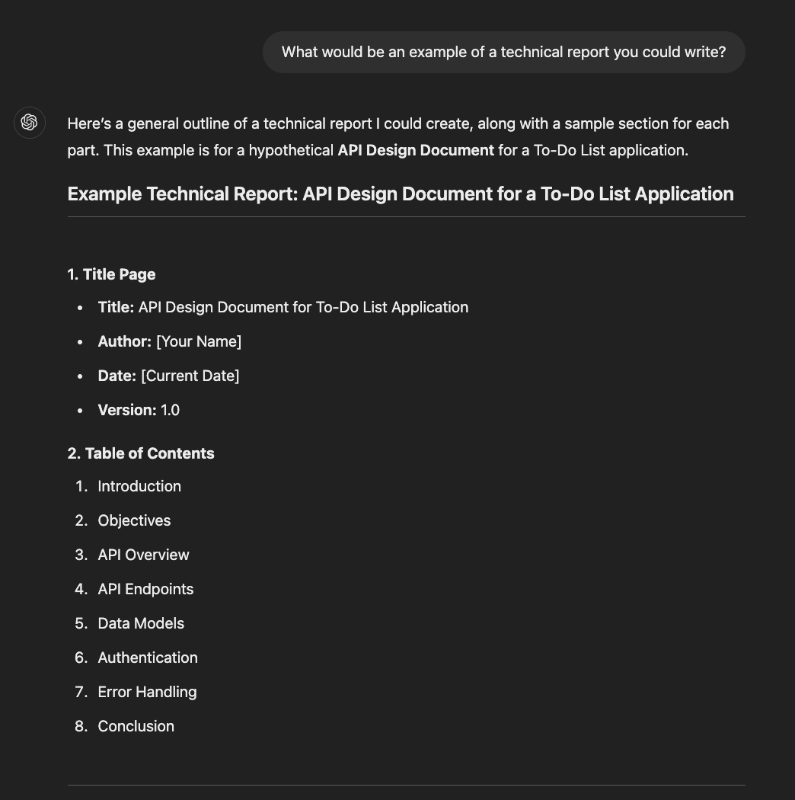
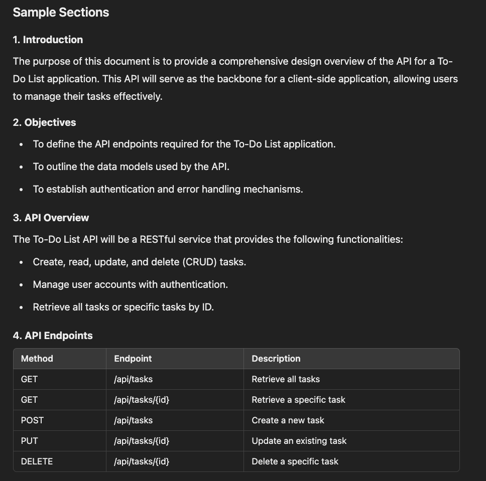

This could be used as boilerplate that would save a great deal of time for a developer. 

But ChatGPT and other language-learning models still aren't able to make decisions about why they are creating an application, or how it works once it's in the hands of the end user. That will always be the job of a human, as it's humans who use the apps that the developer creates. 
***
### References

Flow transformation Team, AI in software development: Key opportunities + challenges, 2024,
https://www.pluralsight.com/resources/blog/business-and-leadership/AI-in-software-development#how-to-use

Vedraj, ChatGPT: Top 10 Use Cases in Software Development, 2024,
https://www.valuecoders.com/blog/blockchain-ml/chatgpt-use-cases-in-software-development/

Rafikadir, 8 great ways to use ChatGPT as a developer, 2023,
https://dev.to/rafikadir/how-to-use-chat-gpt-as-a-developer-gcd
***
<div style="page-break-after: always;"></div>


# Question 5
***
	Explain the legal and ethical impacts of the usage of language-learning model technologies (such as ChatGPT) in written and technical works, such as reports and software projects.
***

# IDENTIFIES MULTIPLE legal and ethical impacts of relevant modern technologies and provides a DETAILED EXPLANATION about each of the impacts in the context of written AND technical works, referencing real-world data, examples or events.


There are significant legal an ethical implications to using language-learning models (LLM) technologies like ChaGPT in the written and technical works 

***

### References

***
<div style="page-break-after: always;"></div>


# Question 6
***
	Explain multiple skills from each of the categories below, and how they’re useful to a software development workplace.

- soft skills
- hard skills
***

Working effectively in a software development environment requires a high level of many soft and hard skills. Each skill will play a different crucial role in advancing your career by contributing to your teams productivity. 

#### Soft Skills

Soft skills are personal attributes that spill over to every aspect of your life, but are especially important in the workplace. They're about how you interact within your team and workplace. 

##### Communication

* Developers need to be effective communicators with both technical and non-technical stakeholders and teammates. The need to be able to describe the same concept in several different ways, but also be very precise with what is required for a particular goal to meet a deadline. The better the communicator, the fewer misunderstandings, the more effective the employee. 
##### Collaboration

* It's rare for software development to be an individual endeavour, therefore to be effective, you must be good at working within a team environment. Collaborative skills allow a developer to work efficiently with others, share ideas, an contribute to collective problem solving.  You need to be patient with others that might have fewer skills and experience, but also be willing to learn from those more senior. You need to be comfortable asking questions, as well as being able to give and  receive constructive feedback gracefully. It also helps to be pleasant to be around, as you'll be spending a lot of time together and this is key to building positive relationships with all stakeholders. 
##### Problem Solving

* A large part of the job as a developer is finding solutions to challenges in a creative and efficient manner. This involves a lot of critical and creative thinking. It's one thing to know what a piece of code does, but it's quite another thing to know when it can be applied to a situation. There would also be a certain element of calculated risk taking, as there is a possibility that you could be spending a good amount of time on a solution that doesn't work. These skills are important for both writing code, and debugging code that already exists. 
##### Time Management

* This is crucial when juggling multiple tasks and deadlines at a time. You need to be able to prioritise tasks to meet the deadlines in the right time and the right order so you're not holding anyone else up with your work. This ties in with collaboration. You also need to be able to set realistic expectations of yourself and not leave large chunks of work to till the last minute. This leads to stress and burnout which can have some very serious negative effects on your longterm health and effectiveness within the team. 
##### Adaptability

* Technology is in a constant state of flux, meaning that there is always going to be new tools, programming languages and processes to learn. There is also always going to be new problems to solve in new fields. Successful devs are able to adapt to ever changing environments and settings by keeping up with new knowledge, skills and tools that are changing industry standards. You also may need to be able to adapt to legacy code in older projects that you might not have seen before. 


#### Hard Skills

Hard skills are the highly teachable and job specific attributes required to be a successful developer. These are skills that could be specific to a particular role or industry. These are measurable technical abilities that a developer must have to be effective. 

##### Programming Languages

* This would relate to both the specific languages a dev is proficient in (Python, JavaScript, Java, C# etc.), but also the ability to write easy to understand D.R.Y code that is as efficient and easy as possible to debug. It's also about knowing the best language to solve for the best use case (Python is better for analytics, JavaScript is better for web development). It's also knowing about best practices. You can technically put all of your code in a single file and it will work, but this has a negative impact on readability and workability. Best practice would be breaking up code into multiple files (preferably a file per task), with detailed and useful comments. 

##### Version Control

* Version Control is essential for tracking changes and collaborating within a team. Using Git and GitHub allow team members to share code that they need to collaborate on from a central spot. It also allows senior engineers to approve versions of the code once it's been throughly checked. Using GitHub properly allows a team to find conflicts, roll back mistakes and problem solve together. It's also a very effective way to backup the work from a task should there be technical issues with a local machine. It's also a place where packages that have been created by a developer can be shared with the wider development community to make use of and iterate over. 
##### Database Management

* Database management is critical for developing the backend of websites. Outside of some very basic websites, there is a high probability that you're going to need to efficiently create, read, update and delete entries in some form of database. This could either be a relational database like SQL, or a NoSQL database like MongoDB. 

##### Agile Methodology

* Agile is a very common method for defining and tracking team based projects. Being familiar and comfortable with Scrum meetings and Kanban boards is essential in this environment. A successful developer will contribute and receive constructive feedback and adapt to project needs as they evolve over time. 


##### Algorithms and Data Structures

* Regardless of what language a developer is working in, they need a strong understanding of algorithms and data structures to be able to solve complex problems efficiently. Developers that can do this design optimised, high performing, scalable code. This would include but not be limited to being able to use Arrays, Hash Tables, Binary Trees, Graphs, Sets, etc. You would be expected to know how to create your own algorithms, but also utilise common search and sort algorithms like QuickSort, MergeSort, Binary Search, Linear Search etc. 


***

### References

Kugell, Alex, 10 Soft Skills Every Software Engineer Should Have, 2024,
https://trio.dev/software-engineer-soft-skills/

CareerScale, Top Hard Skills to Land a Job as a Software Developer, 2023,
https://www.linkedin.com/pulse/top-hard-skills-land-job-software-developer-careerscale/

Eilers, Christian, 10 Hard and Soft Skills to Put On a Resume for Software Developer Jobs, 2024,
https://arc.dev/talent-blog/skills-to-put-on-a-resume/
***
<div style="page-break-after: always;"></div>


# Question 7
***
	Explain multiple roles or job positions that would be found in a medium-sized software development company.
***
IDENTIFIES MULTIPLE roles relevant to a professional information technology environment, and provides a DETAILED EXPLANATION about EACH of the identified roles.


A medium-sized software development company may have anywhere between 50-250 employees, depending on the age of the company, the complexity of it's projects, and the market it serves. The positions will be made up of numerous roles that work together to build, maintain, sell, and support software products. Some common roles include but would not be limited to:

#### Software Developer/Engineer
* Responsibilities: writing, testing and maintaining code for the applications and systems. They can sometimes be divided into teams that work in different areas:
	* Front End Developer - Focused on the user interface and experience. Works with HTML, CSS, JavaScript, in common frameworks like Angular, React or Vue. 
	* Back End Developer - Focused on the server-side logic. Using Python, Java, or Node.js to make API's. 
	* Full Stack Developer - Capable of working in either team. It's highly desirable for all developers to be Full Stack so they have the flexibility to work where ever they're needed. 

#### DevOps Engineer
* Responsibilities: An intermediary between development and operations. They automate deployment, ensure reliability, manage infrastructure, and monitor applications. They use tools like Docker, Kubernotes, or cloud apps like AWS and Azure. 

#### UX/UI Designer
* Responsibilities: Design the user experience (UX) and the user interface (UI) of the software. They makeusre the software is both visually appealing, but also functional and easy to navigate for the end user. 

#### Database Administrator (DBA)
* Responsibilities: A dedicated team member to oversee the creating, performance, security and availability of databases. They handle design, backups, replication and query optimisation. 

#### Project Manager
* Responsibilities: Oversees the scope, timeline, resources, and budget for software projects. Coordinate between the various teams (both design and business) to ensure the harmonious running of daily operations and to ensure that deadlines are met for planned releases. 

#### Product Manager
* Responsibilities: Defines the vision for the business and the products based on market research, user feedback and business goals. Ensures that the product is working to solve a problem for the user case and meeting company objectives. 

#### Scrum Master (Agile Facilitator)
* Responsibilities: Facilitates all things Agile environment related. Hosts sprint planning, stand-ups and retrospectives. Creates and manages the Kanban board, usually in an app like Trello, and helps to remove any obstacles that the team raises. 

#### Technical Support Specialist
* Responsibilities: Customer support for the software. Could be an on phone role. They help customers use the software, answer questions they might have, and escalate the most common issues to the developers. 

#### Technical Writer
* Responsibilities: Creates the documentation and user guides. Developers user manuals. Must be able to translate technical terms to non-technical users and stakeholders. May either source or specify diagrams and figures to be made. 

#### Business Analyst
* Responsibilities: Work between business needs and technical solutions to meet the organisational goals. They translate what the business needs to the development team. They also monitor how well an existing product is meeting it's goals. 
***
### References

Bhatt, Tuhin, # 10 Crucial Roles and Responsibilities In a Software Development Team (+ Best Practices), 2023
https://www.intelivita.com/au/blog/roles-in-a-software-development-team/

Indeed Editorial Team, Software Company Roles, 2024,
https://www.indeed.com/career-advice/career-development/software-company-roles

Gohil, Divyesh, Different Roles in Software Company, 2022,
https://theonetechnologies.com/blog/post/different-roles-in-software-company
***
<div style="page-break-after: always;"></div>
